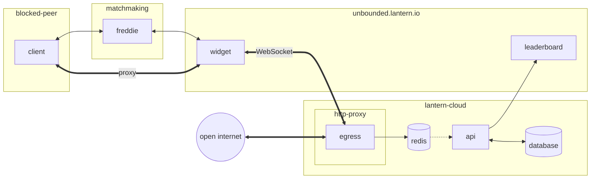

# diagrams

Temporary file for updated diagrams from the [README](./README.md) done natively in mermaid to allow version-controlled updates.

```mermaid
flowchart LR
subgraph blocked-peer
    client
end
subgraph unbounded.lantern.io
    widget
    leaderboard
end
subgraph matchmaking
    freddie <--> widget
end
subgraph lantern-cloud
    subgraph http-proxy
        widget <==> |WebSocket| egress
    end
    egress-->redis[(redis)]
    redis-.->api
    api<-->db[(database)]
end
client <==> |proxy| widget
client <--> freddie
api --> leaderboard
internet((open internet)) <==> egress
```
